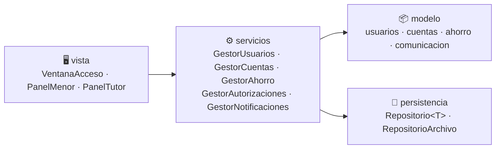
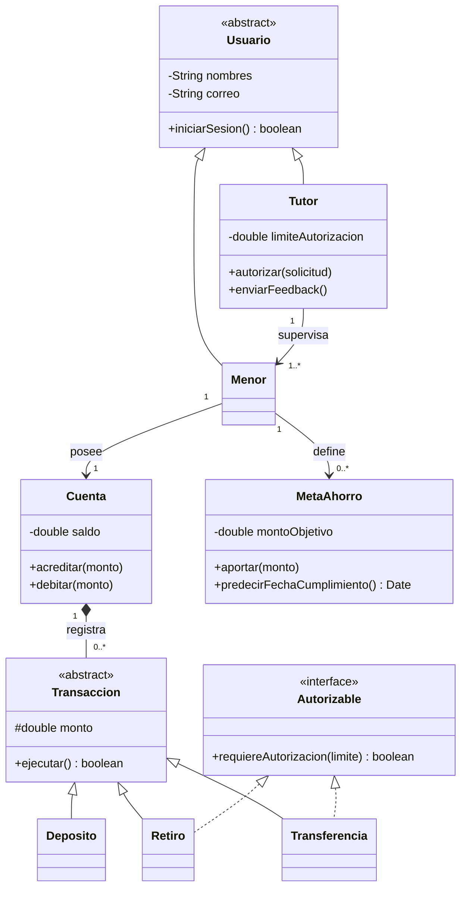

<div align="center">


# 🐷 Finzy

### Aprende a manejar tu dinero jugando

**Aplicación financiera de escritorio con fines educativos para niños, niñas y adolescentes, supervisada por un tutor.**


[Características](#-características) •
[Capturas](#-capturas-de-pantalla) •
[Arquitectura](#-arquitectura) •
[Instalación](#-instalación-y-ejecución) •
[Equipo](#-equipo)

</div>

---

## 📖 Sobre el proyecto

Muchos niños y adolescentes reciben dinero con regularidad, pero no tienen herramientas ni acompañamiento para administrarlo bien. Según la OCDE, cerca del **18 %** de los estudiantes de 15 años evaluados en PISA 2022 no alcanza el nivel básico de competencia financiera.

**Finzy** simula un banco donde los menores practican de forma segura depósitos, retiros, transferencias y ahorro por metas, mientras un **tutor** los acompaña: autoriza transacciones, revisa su progreso y les da consejos.

> 🎯 **Objetivo general:** desarrollar un sistema bancario simulado, basado en programación orientada a objetos, que permita a niños, niñas y adolescentes practicar de manera segura e interactiva la administración del dinero.

---

## ✨ Características

| 👧 Para el menor | 👨‍👩‍👧 Para el tutor |
|---|---|
| 💰 Cuenta bancaria simulada con saldo en tiempo real | 🔗 Vinculación con el menor mediante un código |
| ⬇️ Depósitos, ⬆️ retiros y ⇄ transferencias | ✅ Autorización o rechazo de transacciones |
| 🎯 Metas de ahorro con barra de progreso | 🛡️ Límite de monto configurable |
| 📈 Predicción de la fecha en que se alcanzará la meta | 📊 Resumen gráfico de gasto y ahorro |
| 🧾 Extracto con filtros por fecha y tipo | 💬 Envío de feedback y consejos |
| 🔔 Notificaciones y alertas educativas | 🔔 Notificaciones de solicitudes pendientes |

### 🔐 Roles y seguridad

- Dos perfiles de acceso (**Menor** y **Tutor**) con interfaces y permisos distintos.
- Las operaciones que superan el límite definido por el tutor quedan **pendientes de autorización**.
- Validaciones en todos los formularios (saldo insuficiente, montos inválidos, cuentas inexistentes).

---

## 🖼️ Capturas de pantalla


<div align="center">

| Inicio de sesión | Panel del menor | Metas de ahorro |
|:---:|:---:|:---:|
|  |  |  |

| Operaciones | Panel del tutor | Resumen y feedback |
|:---:|:---:|:---:|
|  |  |  |

</div>

---

## 🏗️ Arquitectura

El proyecto aplica los principios de la **Programación Orientada a Objetos**: abstracción, encapsulación, herencia, polimorfismo e interfaces. Está organizado en capas:



### Modelo de clases (resumen)



> 📐 El diagrama completo está en [`docs/`](docs/).

---

## 🛠️ Tecnologías

- **Lenguaje:** Java 21
- **Interfaz gráfica:** Java Swing / JavaFX *(ajusta según tu proyecto)*
- **Gestión de dependencias:** Maven *(ajusta según tu proyecto)*
- **Persistencia:** archivos locales
- **Control de versiones:** Git y GitHub
- **Diseño:** UML (casos de uso, clases) y storyboard de interfaz

---

## 🚀 Instalación y ejecución

### Requisitos previos

- [JDK 21](https://adoptium.net/) o superior
- [Maven 3.9+](https://maven.apache.org/) *(si usas Maven)*
- Git

### Pasos

```bash
# 1. Clona el repositorio
git clone https://github.com/<tu-usuario>/finzy.git

# 2. Entra a la carpeta del proyecto
cd finzy

# 3. Compila el proyecto
mvn clean package

# 4. Ejecuta la aplicación
java -jar target/finzy.jar
```

### Cuentas de prueba

| Rol | Correo | Contraseña |
|---|---|---|
| Tutor | `tutor@finzy.com` | `tutor123` |
| Menor | `menor@finzy.com` | `menor123` |

> ⚠️ Son datos de demostración (dinero simulado). Cámbialos por los de tu proyecto.

---

## 📂 Estructura del proyecto

```text
finzy/
├── docs/                    # Documentación, diagramas e imágenes
│   └── img/
├── src/
│   └── main/java/finzy/
│       ├── modelo/
│       │   ├── usuarios/        # Usuario, Menor, Tutor, Rol
│       │   ├── cuentas/         # Cuenta, Transaccion, Deposito, Retiro, Transferencia
│       │   ├── ahorro/          # MetaAhorro, Aporte
│       │   └── comunicacion/    # Notificacion, Feedback, SolicitudAutorizacion
│       ├── servicios/           # Lógica de la aplicación
│       ├── persistencia/        # Repositorio<T>, RepositorioArchivo
│       └── vista/               # Ventanas y paneles
├── pom.xml
├── LICENSE
└── README.md
```

---

## 📋 Requerimientos y casos de uso

El sistema cubre **15 requerimientos funcionales** y **15 casos de uso**:

<details>
<summary><b>Ver lista de requerimientos funcionales</b></summary>

| ID | Requerimiento |
|---|---|
| RF1 | Registrar usuario |
| RF2 | Iniciar sesión |
| RF3 | Vincular menor de edad con tutor |
| RF4 | Gestionar cuenta bancaria simulada y consultar saldo |
| RF5 | Realizar depósito |
| RF6 | Realizar retiro |
| RF7 | Realizar transferencia |
| RF8 | Autorizar o rechazar transacciones |
| RF9 | Consultar extracto |
| RF10 | Crear meta de ahorro |
| RF11 | Aportar a meta de ahorro |
| RF12 | Consultar progreso y predicción de meta |
| RF13 | Recibir notificaciones y alertas educativas |
| RF14 | Enviar feedback y consejos |
| RF15 | Monitorear resumen de gasto y ahorro |

</details>

---

## 🗺️ Hoja de ruta

- [x] Definición del proyecto, objetivos y justificación
- [x] Requerimientos funcionales y casos de uso
- [x] Diagrama de clases y storyboard
- [ ] Implementación del modelo (usuarios, cuentas, ahorro)
- [ ] Servicios y persistencia
- [ ] Interfaz gráfica
- [ ] Pruebas y correcciones
- [ ] Contenidos educativos adicionales
- [ ] Versión para familias e instituciones educativas

---

## 👥 Equipo

**Grupo N° 01 · Programación Orientada a Objetos (22951) · Grupo B1**

| Integrante | Rol |
|---|---|
| **William Torres** | Líder de desarrollo, tester y analista |
| **Juan David Doria De la Hoz** | Desarrollador y documentador |
| **Jhoan Sebastián Perea Montañez** | Diseñador, documentador y desarrollador |

---

## 📚 Referencias

- OECD. (2024). *PISA 2022 results (Volume IV): How financially smart are students?* OECD Publishing. https://doi.org/10.1787/5a849c2a-en
- Aflatoun International. (2024). *PISA 2022 financial literacy results.* https://aflatoun.org/latest/news/pisa/
- Foro Económico Mundial. (2025). *El efecto dominó de la educación financiera de los estudiantes a los padres.*
- Programa de las Naciones Unidas para el Desarrollo. (2022). *Gamificación para la educación financiera.*
- Salinas, M. A., et al. (2024). Importancia de la educación financiera en niños y niñas a temprana edad. *Know and Share Psychology.*

---

## 📄 Licencia

Distribuido bajo la licencia **MIT**. Consulta el archivo [`LICENSE`](LICENSE) para más información.

---

<div align="center">

Proyecto académico · **Universidad Industrial de Santander**
Escuela de Ingeniería de Sistemas e Informática · Programa de Ingeniería de Sistemas

⭐ Si te gusta Finzy, ¡dale una estrella al repositorio!

</div>
